# Table Canvas

Table Canvas is a local-first visual data workbench for turning CSV and Excel files into reusable transformation pipelines. Connect tables and transformations on a canvas, then explore the results through grids, charts, dashboards, and reports without maintaining formulas across cells.

> **Built solo. Core technical pieces:** DuckDB-WASM, a dependency-aware DAG computation engine, transactional project-wide history, a ReactFlow canvas, and local-first IndexedDB persistence.
>
> **Live:** [table-canvas.vercel.app](https://table-canvas.vercel.app)

Table Canvas runs SQL inside a Web Worker and persists complete projects locally in IndexedDB, so no server is required. An optional Express and MongoDB backend adds authentication, cross-device synchronization, offline replay, and conflict handling. [How it works →](docs/architecture.md)

<details open>
<summary><strong>Product walkthrough</strong></summary>

### Workbook import

Inspect an Excel workbook, review every available sheet and row count, then choose which tables to add to the project.

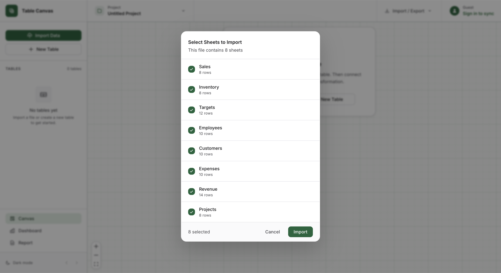

### Visual pipeline

Source tables feed joined and summarized results, while the linked chart remains part of the visible transformation lineage.

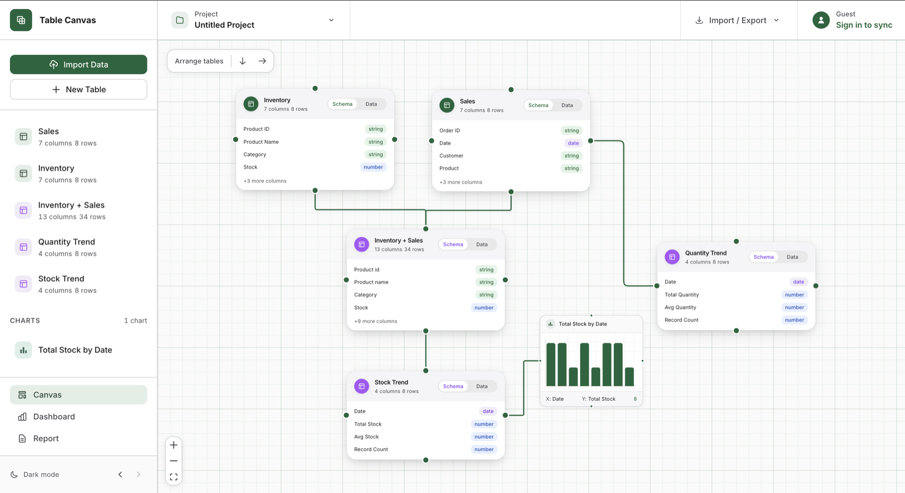

### Combine tables

Join or append two tables, select the matching columns and output fields, and review the match rate before creating the derived result.

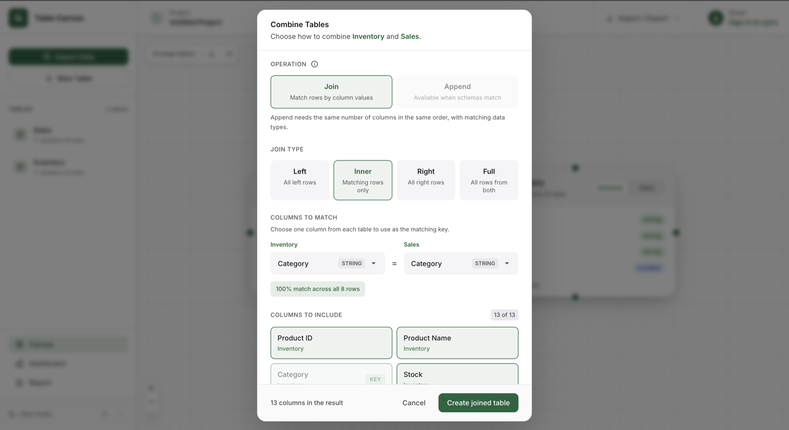

### Table view

#### Editable grid

Edit typed source data in a virtualized spreadsheet with dedicated row, column, filter, chart, and suggestion controls.

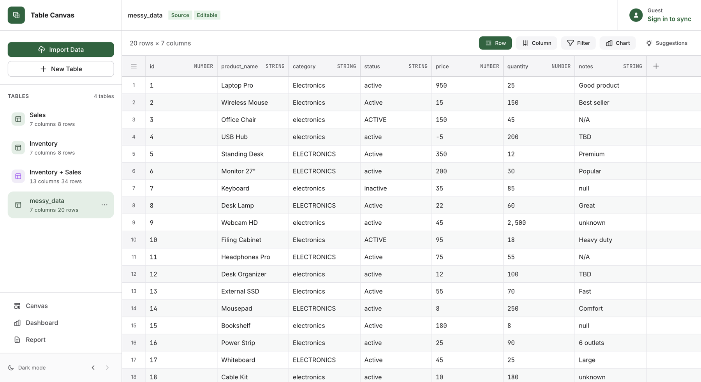

#### Formula columns

Build typed calculated columns from existing fields and spreadsheet-style functions, with the result type validated before the column is added.

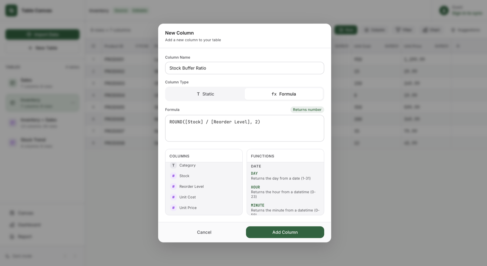

### Suggestions panel

#### Analysis recommendations

Profile-driven recommendations explain why an analysis fits the table and can create the resulting chart directly.

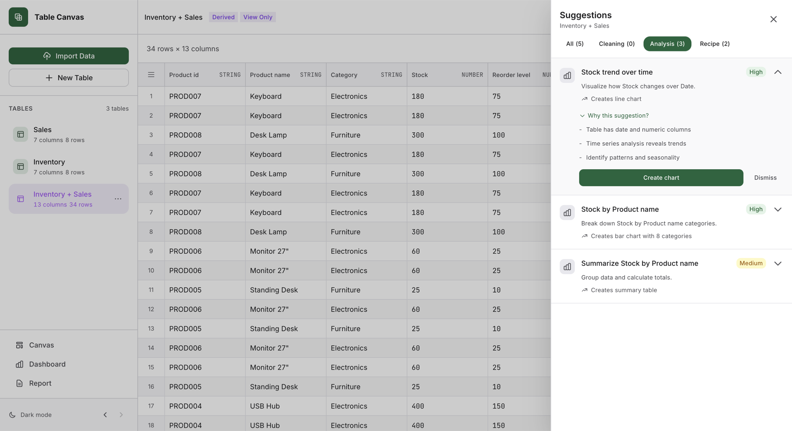

#### Batch cleaning

Cleaning suggestions show affected values and combine compatible fixes into one reviewable action.

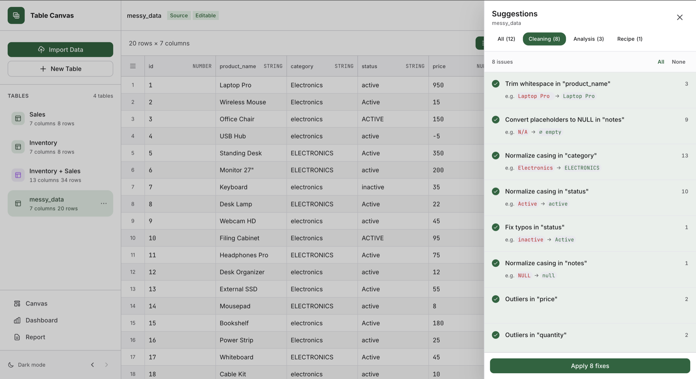

### Chart editor

Switch between bar, line, pie, and scatter charts while configuring the source, axes, measure, and aggregation against live project data.

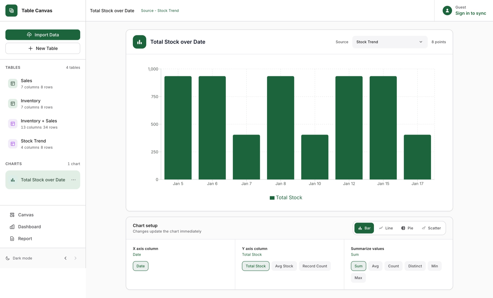

### Project dashboard

#### Overview and lineage

Workspace totals and completeness sit beside a compact data-flow map of source tables, derived tables, and charts.

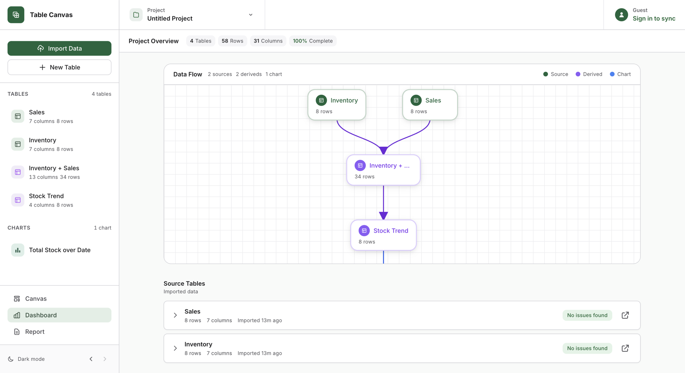

#### Data health and next actions

Table-level health checks and suggested analyses turn the dashboard into an actionable project overview.

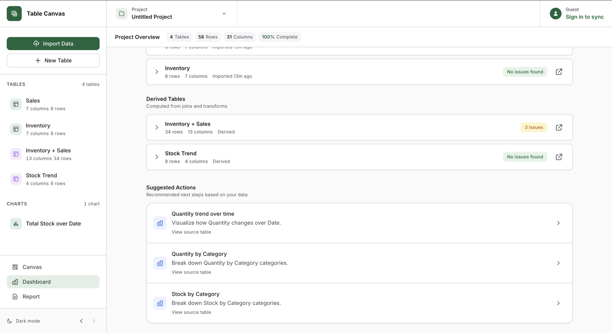

### Report builder

#### Live analysis

Combine summary metrics, narrative context, live project charts, review notes, and supporting analysis in one document.

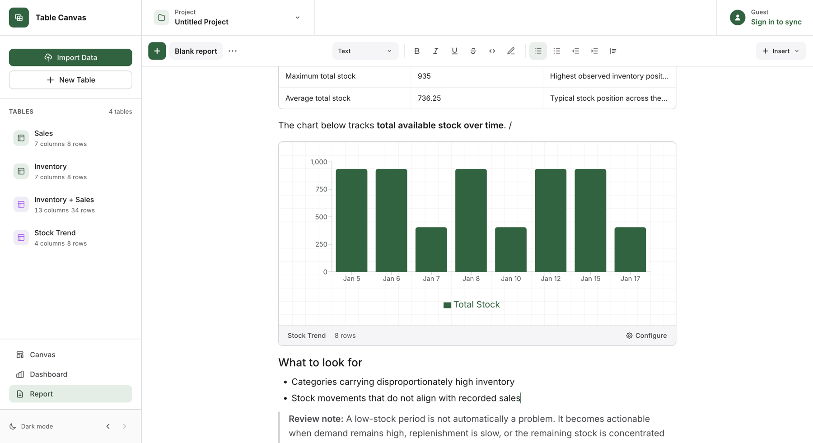

#### Composable blocks

The insertion menu adds project charts, linked tables, editable tables, callouts, and collapsible sections wherever the analysis needs them.

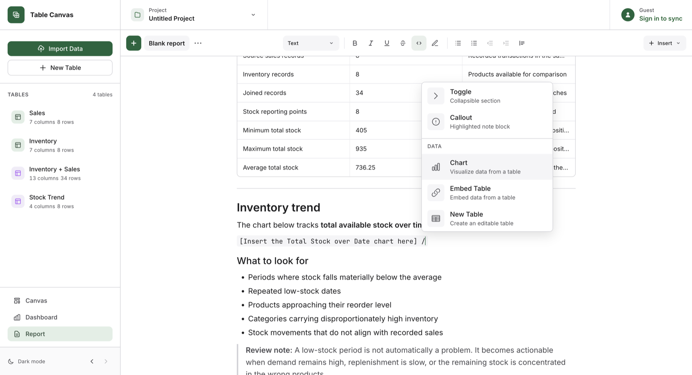

### Project portability

Export a self-contained ZIP with project state, Excel data, and reports, or import a saved Table Canvas project without requiring an account.

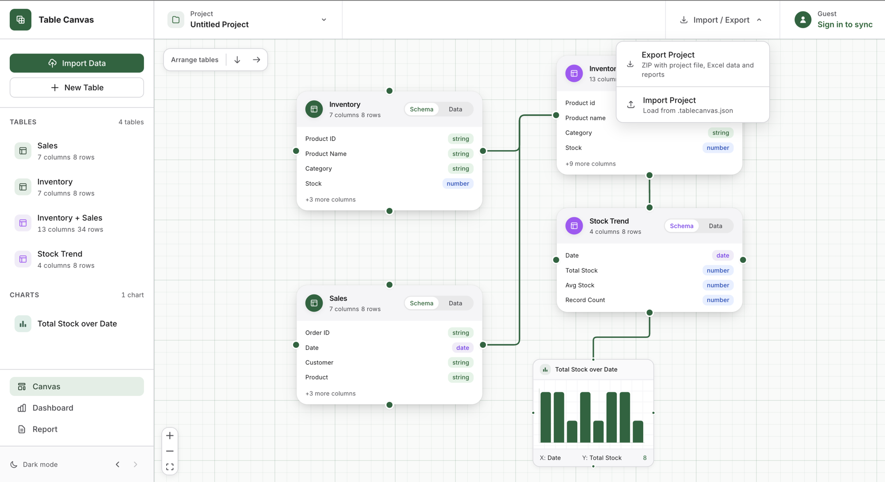

</details>

## Quick start

Requires Node.js 24 or newer. The browser-local workspace needs no Docker, database, or configuration.

```bash
npm install
npm run dev
```

Open `http://localhost:3000` and choose **Continue as guest**. For authentication, sync, Docker, and environment variables, see [Setup](docs/setup.md).

## Notable features

<table>
  <tr>
    <td width="33%" valign="top">
      <strong>Visual, reactive pipelines</strong>
      <p>Connect tables using filters, joins, grouping, selections, calculated columns, and unions while the dependency graph automatically refreshes affected derived tables.</p>
    </td>
    <td width="33%" valign="top">
      <strong>Spreadsheet-style table view</strong>
      <p>Edit source data with formula columns, pattern-aware autofill, row and column operations, type-aware validation, filtering, and keyboard navigation.</p>
    </td>
    <td width="33%" valign="top">
      <strong>Suggestions panel</strong>
      <p>Profile tables to uncover patterns and receive ranked recommendations for charts, analyses, transformations, cleaning actions, and guided multi-step recipes.</p>
    </td>
  </tr>
  <tr>
    <td width="33%" valign="top">
      <strong>Project-wide undo and redo</strong>
      <p>Reverse canvas operations, cell edits, autofill, rows, columns, formulas, imports, and chart changes through context-aware project history.</p>
    </td>
    <td width="33%" valign="top">
      <strong>Project dashboard</strong>
      <p>Review workspace totals, completeness, table quality, lineage, and recommended actions from one interactive project overview.</p>
    </td>
    <td width="33%" valign="top">
      <strong>Report builder</strong>
      <p>Create documents with rich text, live tables, charts, and editable inline data, then export them as HTML or PDF.</p>
    </td>
  </tr>
  <tr>
    <td width="33%" valign="top">
      <strong>Local-first and portable</strong>
      <p>Run SQL and persist complete projects locally, then export and import portable bundles without requiring an account.</p>
    </td>
    <td width="33%" valign="top">
      <strong>Reliable account sync</strong>
      <p>Sync projects, reports, and files across devices using durable offline queues, revision checks, and recoverable conflict handling.</p>
    </td>
    <td width="33%" valign="top">
      <strong>Safe same-browser tabs</strong>
      <p>Within one browser, keep one writable project tab while other tabs mirror durable state and different projects remain independently editable.</p>
    </td>
  </tr>
</table>

## Docs

| Document                                             | What's inside                                      |
| ---------------------------------------------------- | -------------------------------------------------- |
| [Architecture](docs/architecture.md)                 | Runtime, DAG, state, computation, persistence      |
| [Features](docs/features.md)                         | Canvas, grid, charts, dashboards, reports          |
| [Setup](docs/setup.md)                               | Run modes, configuration, scripts, troubleshooting |
| [Technology stack](docs/stack.md)                    | Libraries, infrastructure, and responsibilities    |
| [Repository structure](docs/repository-structure.md) | File map and guided code-reading paths             |
| [Session and data reliability](docs/reliability.md)  | Isolation, ownership, synchronization, limits      |
| [Testing](docs/testing.md)                           | Test suites, coverage, CI, release checks          |
| [API](docs/api.md)                                   | Optional backend endpoints and contracts           |
| [Production deployment](docs/production.md)          | Hosting, backups, monitoring, release and rollback |

## License

This project is licensed under the [PolyForm Noncommercial License 1.0.0](LICENSE).