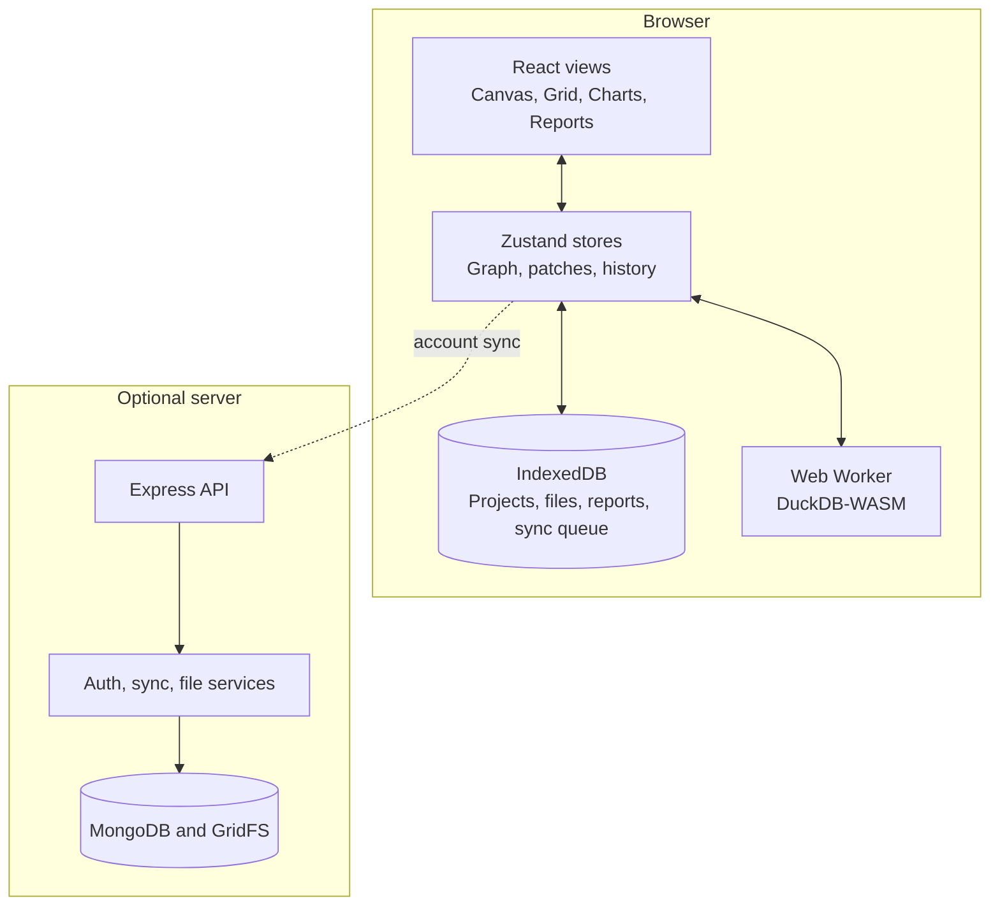
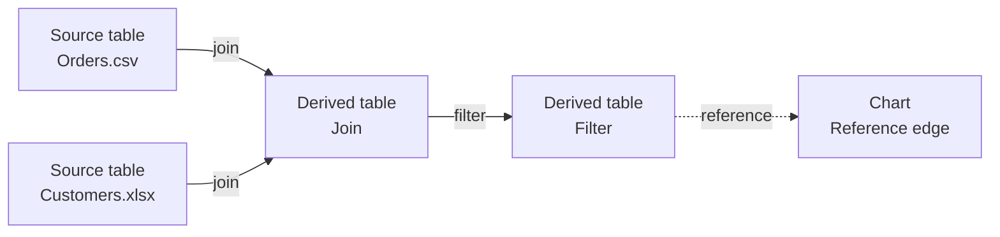
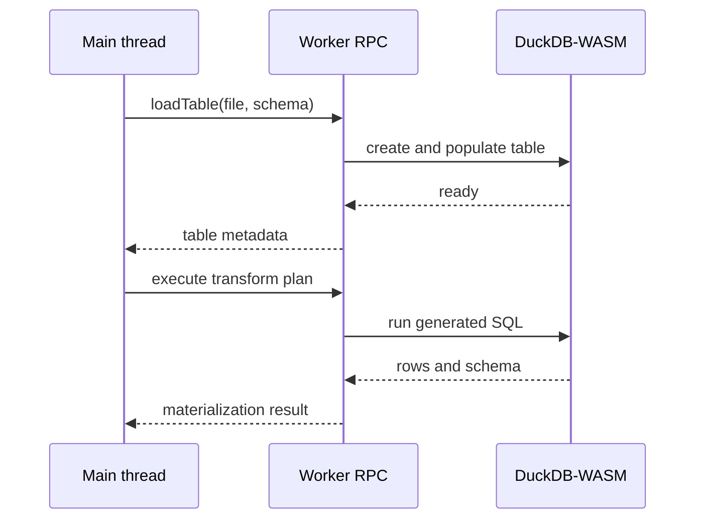

# Architecture

Table Canvas treats the browser as the primary runtime. DuckDB-WASM performs computation, IndexedDB owns durable local state, and the optional server adds identity and synchronization without becoming part of the query path.

## System overview



The browser path is complete on its own. When account sync is enabled, project snapshots and source files cross the optional API boundary; SQL execution and materialized tables remain in the browser.

The file-level map lives in [Repository structure](repository-structure.md), and the dependency inventory lives in [Technology stack](stack.md).

## The DAG

A project is a directed acyclic graph. Nodes are tables and charts; edges are transforms that turn upstream tables into downstream ones.



Data-transform edges participate in computation. The chart reference edge records lineage without producing another table.

### Node types

| Kind | Description |
|------|-------------|
| `source_table` | Imported CSV/Excel or a manually created table. Holds a file reference, schema, and patches (cell edits). |
| `derived_table` | Computed from a transform applied to one or more upstream tables. Read-only. |
| `chart` | A visualization bound to a source table. |

See `src/types/node.types.ts` and `src/types/transform.types.ts` for the exact shapes.

### Edges

```typescript
interface Edge {
  id: string
  fromNodeId: string      // upstream (data source)
  toNodeId: string        // downstream (dependent)
  transformType: TransformType
}
```

### Cycle detection

Before an edge is created, the graph is checked for cycles with a reachability test (`src/engine/graph/dependencyGraphCycle.ts`, re-exported by `dependencyGraph.ts`). A self-loop, or a target that can already reach the source, is rejected and the connection is blocked.

### Computation order

`getComputationOrder` does a topological sort so upstream tables are materialized before the tables that depend on them.

## State management

Zustand stores, with Immer for immutable updates. State is split by subdomain under `src/state/`:

| Area | Path | Responsibility |
|------|------|----------------|
| App session | `app-session/` | Boot, auth (`useAuthState`), autosave, project actions, catalog reconcile |
| Document | `document/` | Per-document identity, write lease, mirror invalidation |
| Project helpers | `project/` | Load/create/duplicate lifecycle |
| Runtime | `runtime/`, `tableRuntimeStore.ts` | Per-tab compute coordination and cache/dirty state (not persisted) |
| Graph slices | `stores/` | `nodesSlice`, `edgesSlice`, `patchesSlice`, `historySlice`, `selectionSlice`, column ops |

Other stores:

- **`projectStore`**: composed graph state from `stores/`
- **`dataStore`**: temporary in-memory rows while importing/editing; DuckDB is authoritative for materialized rows
- **`useTableRuntimeStore`**: per-tab cache/dirty/compute flags kept out of the persisted document
- **`useProfilingStore`** (`src/lib/profiling/`): per-column profiles
- **`suggestionsStore`** (`src/suggestions/panel/state/`): analysis/cleaning suggestions
- **`reportStore`** (`src/report/`): report documents

`AppProvider` (`src/state/app-session/AppProvider.tsx`, exported through `src/state/AppContext.ts`) ties it together: it boots the engine, checks auth, loads or creates a project, materializes tables, and auto-saves when the graph changes.

### Transactional history

Canvas operations, table edits, formulas, charts, and imports share the project history in `src/state/stores/historySlice.ts`. Simple edits save a snapshot before mutation. Multi-step operations open a transaction, then commit one history entry or restore the original state on failure.

```mermaid
flowchart LR
    Action["Project action"] --> Snapshot["Snapshot graph, patches, selection"]
    Snapshot --> Mutation["Apply one or more mutations"]
    Mutation --> Commit["Commit history entry"]
    Commit --> Undo["Undo or redo"]
    Undo --> Restore["Restore project state"]
    Restore --> Reconcile["Reconcile changed tables"]
    Reconcile --> Invalidate["Invalidate affected descendants"]
    Invalidate --> Recompute["Recompute on demand"]
```



History is capped by entry count and serialized size. File references retained only by undo entries are protected from cleanup. Reports keep a separate TipTap history, and the global shortcut router directs each command to the active text field, report, or project so one history never falls through into another.

### Dirty propagation

Editing a source cell updates its patches and marks the node plus every downstream descendant dirty in `useTableRuntimeStore`. These flags are not persisted on project nodes. Dirty tables are recomputed the next time they're needed.

### Cross-tab session vs document coordination

Auth cookies are origin-shared, while guest choice and the initiating tab's explicit sign-out marker are tab-local (`sessionStorage`). Explicit account sign-out revokes the server refresh session and clears the shared cookies. Auth React state is **not** broadcast between tabs. Within a storage scope, open-document invalidations and project-catalog changes use `BroadcastChannel`, with `visibilitychange` refreshes as a fallback. Full contract: [Reliability — Cross-tab authentication and session](reliability.md#cross-tab-authentication-and-session).

## Computation engine

### Web Worker

DuckDB-WASM runs in a dedicated worker (`src/engine/worker/`) so SQL execution never blocks the UI thread. The main thread talks to it over a small RPC layer (`src/engine/worker/rpc.ts`).



### Materialization

`ensureTableMaterialized` (`src/engine/materialization/materializationService.ts`) orchestrates computation:

1. Dedupe: an `inProgressMaterializations` map prevents duplicate concurrent requests.
2. Resolve the computation order (topological sort).
3. Materialize each node in order; `materializationCoordinator.ts` serializes engine mutations through a promise queue.
4. Update cache info.

### Cache invalidation

Version hashes decide whether cached data is stale:

```typescript
// source table
hash = simpleHash(`source:${tableId}:${fileRef}:${patchVersion}:${schemaFingerprint}`)

// derived table
hash = simpleHash(`derived:${tableId}:${transformDefJson}:${upstreamHashes}`)
```

If a hash matches the cached one, the cached result is reused; otherwise it recomputes.

## Profiling

When a table is opened, the profiler (`src/lib/profiling/`) computes per-column statistics in two phases: phase 1 is fast (counts, null rate, basic types) and phase 2 fills in the heavier stats asynchronously. Profiles also get semantic hints (e.g. "looks like an email/date column"). These feed the grid's column stats, the dashboard, and the suggestion engine.

## Transforms

`TransformType` in `src/types/transform.types.ts` contains six user-facing data transforms: filter, group and summarize, join, select, calculated column, and union. Each edge stores a serializable transform plan. The worker turns that plan into SQL when its target table is materialized.

An internal `reference` edge binds a chart to a table and participates in lineage without producing data. User-facing behavior and supported operators are documented in [Features](features.md#transforms); the TypeScript definitions are the source of truth for plan shapes.

## Persistence

Client persistence is organized under `src/persistence/`:

| Layer | Path | Role |
|-------|------|------|
| Storage scopes + IndexedDB | `storage/` (`local-db/`, `storageScope.ts`) | Owner-scoped projects, files, reports |
| Import / export | `import-export/` | CSV/Excel/ZIP parsers and project ZIP export |
| Cross-device merge | `merge/` | Entity-level merge after HTTP 409 |
| Sync | `sync/files`, `sync/project`, `sync/session` | File GC/upload, project save queue, session sync |
| Report export helpers | `report-export/` | Data extraction for report export |

### IndexedDB

The `table-canvas-v2` database is currently schema version 3. Upgrades migrate
supported versions in place; the legacy guest partition is also migrated to a
scoped guest id. Records are keyed by owner scope (`guest:<id>` or
`account:<userId>`).

The database has five stores:

- `projects` — owner-scoped project snapshots and server revisions;
- `files` — owner-scoped source bytes and metadata;
- `reports` — owner/project-scoped report documents;
- `projectSync` — durable queued project operations;
- `projectSyncBase` — the last server-acknowledged snapshot used for
  three-way conflict merges.

Materialized DuckDB rows and cache/dirty flags are runtime state, not IndexedDB
records.

### Server sync

When the backend is available, session sync orchestration uses the project save
queue under `src/persistence/sync/project/save/`, file sync, and the
`syncService.ts` re-export barrel to persist through the API and load state on
startup. Saves carry the revision they were based on and the server applies
them only if it still matches, so a save built on stale data is rejected rather
than allowed to overwrite newer work. A rejection is resolved on the client by
`projectMerge`, which merges the last acknowledged base, the local payload,
and the current server state entity by entity, and retries the save against the
fresh revision. Only an unmergeable conflict falls back to keeping the local
work as a separate conflict copy. When the backend is unreachable, all of this
is skipped and the app stays purely local.

Within one browser, `documentLease` gives a single tab the right to write a given project while `documentMirror` invalidates readers over `BroadcastChannel` (readers reload from IndexedDB). `projectCatalog` fans out create/rename/delete within a storage scope the same way. See [Reliability](reliability.md) for the ownership and merge contract in full.

## Optional server boundary

The Express application exposes authentication, project, and file routes. Its services enforce account capacity, payload limits, storage quotas, and revision checks before writing to MongoDB or GridFS. It does not execute transforms or materialize tables.

Client limits in `src/shared/limits.ts` and server limits in `server/src/config/limits.ts` are intentionally mirrored because the frontend and backend build independently. A limit change must update both files. See [Repository structure](repository-structure.md#optional-backend) for the module map and [API](api.md) for the request contracts.

## Error boundaries

Each major view (Canvas, Grid, Charts, Dashboard, Reports) is wrapped in `ErrorBoundary` (`src/observability/ErrorBoundary.tsx`), so a render error in one area shows a recovery UI instead of taking down the whole app.

Continue with [Session and data reliability](reliability.md) for the synchronization contracts or [Repository structure](repository-structure.md) for implementation entry points.
